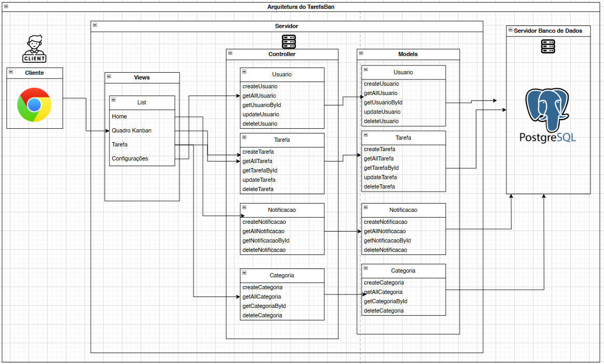

# WAD - Web Application Document - 📌 TarefaBan

## Sumário

[1. Introdução](#c1)
[2. Diagrama do banco de dados](#c2)

## <a name='c1'>1. Introdução</a>

&emsp; O **TarefaBan** é uma solução web desenvolvida para auxiliar os usuários a gerenciar suas obrigações, por meio da organização em um quadro KanBan.

&emsp; A utilização do quadro KanBan está sendo aplicada em instituições estudantis e ambientes profissionais. Por ser uma ferramenta de gerenciamento simples e eficaz, muitas pessoas também usam esse método para o planejamento pessoal. No entanto, muitos desses quadros são feitos de maneira física, o que impossibilita o seu acesso remoto e a colaboração do dono que não está presente no local onde o quadro Kanban foi criado.

&emsp; Para resolver esse problema, projetou-se o **TarefaBan**: um site de gerenciamento de tarefas com base em um quadro KanBan. Nessa plataforma, o usuário pode criar, editar e deletar suas tasks em qualquer local e no momento que desejar. Dessa forma, é possível realizar o planejamento pessoal de maneira flexível e sem limitações dos quadros físicos.

## <a name='c2'>2. Diagrama do banco de dados</a>

&emsp; Em relação à modelagem do banco de dados do projeto, pode-se separar em modelo lógico e modelo físico:

### Modelo Lógico

&emsp; O modelo lógico da plataforma compreende a criação das entidades, a definição da cardinalidade dos relacionamentos entre elas e a definição de seus atributos junto ao seus respectivos tipos de dados correspondentes. A seguinte figura demonstra como ficou essa etapa:

<div align='center'>

<sup>Figura 1: Modelo Lógico do Banco de Dados</sup>


<sup>Fonte: Material produzido pelo autor (2025)</sup>

</div>

&emsp; A explicação de cada entidade e seus respectivos atributos está contida nos seguintes quadros:

<div align='center'>

<sup>Quadro 1: Entidade usuários</sup>

| Entidade | 
|:----:|
| **usuarios**: Usuários cadastrados na plataforma | 
| **Atributos** |
| **id (PK)**: Número de identificação do usuário |
| **nome**: Nome do usuário
| **email**: E-mail cadastrado pelo usuário
| **senha**: Senha cadastrado pelo usuário
| **created_at**: Momento em que o usuário foi criado
| **updated_at**: Momento em que o usuário alterou suas informações

<sup>Fonte: Material produzido pelo autor (2025)</sup>

</div>
<div align='center'>

<sup>Quadro 2: Entidade tarefas</sup>

| Entidade | 
|:----:|
| **tarefas**: Tarefas criadas pelo usuário | 
| **Atributos** |
| **id (PK)**: Número de identificação da tarefa |
| **nome**: Nome da tarefa
| **titulo**: Título da tarefa
| **descricao**: Descrição da tarefa
| **estado**: Estado da tarefa (planejamento, fazendo, feito)
| **importancia**: Importância da tarefa (altíssima, alta, média, baixa e baixíssima)
| **created_at**: Momento em que a tarefa foi criada
| **updated_at**: Momento em que a tarefa foi editada
| **prazo**: Data que a tarefa deve estar concluída

<sup>Fonte: Material produzido pelo autor (2025)</sup>

</div>
<div align='center'>

<sup>Quadro 3: Entidade categoria</sup>

| Entidade | 
|:----:|
| **categoria**: Categoria cadastrada pelo usuário| 
| **Atributos** |
| **id (PK)**: Número de identificação da categoria |
| **titulo**: Título da categoria (doméstica, profissional, educacional e outros)

<sup>Fonte: Material produzido pelo autor (2025)</sup>

</div>
<div align='center'>

<sup>Quadro 4: Entidade notificação</sup>

<div align='center'>

| Entidade | 
|:----:|
| **notificacao**: Notificação  | 
| **Atributos** |
| **id (PK)**: Número de identificação da tarefa |
| **titulo**: Título da notificação
| **descricao**: Descrição da notificação
| **id_tarefa (FK)**: Tarefa relacionada à notificação
| **created_at**: Momento em que a notificação foi criada

</div>

<sup>Fonte: Material produzido pelo autor (2025)</sup>

</div>

### Modelo Físico

&emsp; O modelo Físico do banco de dados compreende a criação das tabelas na linguagem SQL, e ficou da seguinte maneira:

&emsp; Criação da tabela de usuários:

````
CREATE TABLE IF NOT EXISTS usuario(
    id SERIAL PRIMARY KEY,
    nome VARCHAR(80) NOT NULL,
    email VARCHAR(80) NOT NULL,
    senha VARCHAR(20) NOT NULL,
    created_at TIMESTAMP DEFAULT CURRENT_TIMESTAMP,
    updated_at TIMESTAMP DEFAULT CURRENT_TIMESTAMP    
);
````
&emsp; Criação da tabela de tarefas:

````
CREATE TABLE IF NOT EXISTS tarefas (
    id SERIAL PRIMARY KEY,
    titulo VARCHAR(60) NOT NULL,
    descricao TEXT,
    estado VARCHAR(12) NOT NULL,
    importancia VARCHAR(9) NOT NULL,
    created_at TIMESTAMP DEFAULT CURRENT_TIMESTAMP,
    updated_at TIMESTAMP DEFAULT CURRENT_TIMESTAMP,
    prazo DATE
);
````

&emsp; Criação da tabela de categoria:

````
CREATE TABLE IF NOT EXISTS categoria(
    id SERIAL PRIMARY KEY,
    titulo VARCHAR(60) NOT NULL
);
````

&emsp; Criação da tabela de notificação:

````
CREATE TABLE IF NOT EXISTS notificacao (
    id SERIAL PRIMARY KEY,
    titulo VARCHAR(60),
    descricao TEXT,
    id_tarefa INTEGER REFERENCES tarefas(id) ON DELETE CASCADE,
    created_at TIMESTAMP DEFAULT CURRENT_TIMESTAMP
);
````

## <a name='c3'>3. Arquitetura MVC</a>

&emsp; A arquitetura MVC é um padrão de design de software que divide a estrutura do projeto em: Models, Controllers e Views. A função de cada elemento é explicitada da seguinte maneira:

- Models: Responsável por fazer as requisições e alterações no banco de dados.

- Controllers: Responsável por fazer a comunicação entre o views e o models, enviando as requisições e respostas entre os elementos.

- Views: Responsável pela resposta visual do sistema, mostrando as respostas e como fazer as requisições.

&emsp; Dessa forma, elaborou-se o seguinte diagrama da arquitetura MVC do TarefaBan:

<div align="center">
<sup>Figura 2: Diagrama da Arquitetura do MVC</sup>
</div>
<div align="center">

</div>
<div align="center">
<sub>Fonte: Material produzido pelos autor (2025)</sub>
</div>

## <a name='c4'>4. WebAPI</a>

&emsp; API é um conjunto de regras e protocolos para que ocorra a transferência de informações entre os componentes da aplicação.

&emsp; Sob essa perspectiva, construiu-se o seguinte quadro com as APIs:

<div align="center">
<sup>Quadro 5: Informações da API</sup>
</div>

| **Rota** | **Método** | **Header** | **Body** | **Formato de Response**
| :---: | :---: | :---: | :---: | :---: |
/usuario | POST | application/json | nome, email, senha | JSON
/usuario | GET | application/json | - | JSON
/usuario/:id | GET | application/json | id | JSON
/usuario/:id | PUT | application/json | id, nome, email, senha | JSON
/usuario/:id | DELETE | application/json | id | JSON
/tarefa | POST | application/json | titulo, descricao, estado, importancia, prazo | JSON
/tarefa | GET | application/json | - | JSON
/tarefa/:id | GET | application/json | id | JSON
/tarefa/:id | PUT | application/json | id, titulo, descricao, estado, importancia, prazo | JSON
/tarefa/:id | DELETE | application/json | id | JSON
/notificacao | POST | application/json | titulo, descricao, id_tarefa | JSON
/notificacao | GET | application/json | -  | JSON
/notificacao/:id | GET | application/json | id | JSON
/notificacao/:id | DELETE | application/json |  id| JSON
/categoria | POST  | application/json | titulo | JSON
/categoria | GET | application/json | - | JSON
/categoria/:id | GET | application/json | id | JSON
/categoria/:id | DELETE | application/json | id | JSON

<div align="center">
<sub>Fonte: Material produzido pelo autor (2025)</sub>
</div>